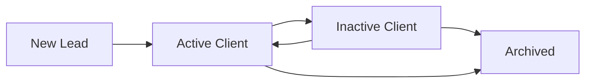

# Client Stages & Pipeline

Track where each client is in your sales and service lifecycle using stages. Visualize your pipeline with a kanban board and move clients through stages with drag-and-drop.

## What are Client Stages?

Stages categorize clients based on where they are in the relationship:

<CardGroup cols={2}>
  <Card title="New Lead" icon="user-plus" color="#1565C0">
    **Just captured, not yet contacted.**
    
    Examples:
    - Form submission from website
    - Referral from existing client
    - Cold call prospect
    - Trade show lead
  </Card>
  
  <Card title="Active Client" icon="check-circle" color="#2D6B42">
    **Paying customer with ongoing service.**
    
    Examples:
    - Regular maintenance contract
    - Recently completed job
    - Repeat customer
  </Card>
  
  <Card title="Inactive Client" icon="pause-circle" color="#DC2626">
    **No recent activity, may need re-engagement.**
    
    Examples:
    - No jobs in 6+ months
    - Service contract expired
    - Moved out of service area
  </Card>
  
  <Card title="Archived" icon="archive" color="#9C9B99">
    **Removed from active lists, history preserved.**
    
    Examples:
    - Business closed
    - Moved away permanently
    - Requested no future contact
  </Card>
</CardGroup>

## Stage Lifecycle

The typical client journey:



- **New Lead → Active Client:** When you complete the first job or they sign a contract
- **Active Client → Inactive Client:** Automatically after 6 months of no activity (configurable)
- **Inactive Client → Active Client:** When they book a new job
- **Any Stage → Archived:** Manual archive when relationship ends permanently

---

## Kanban Board View

Visualize your client pipeline as a kanban board with drag-and-drop stage changes.

### Switching to Kanban View

1. Go to **Clients** page
2. Click **Kanban** button (top right, next to Table/List view)
3. Board appears with columns for each stage

<!-- TODO: Screenshot of kanban board -->

### Kanban Layout

Each column represents a stage:
- **New Lead** - leftmost column
- **Active Client** - center
- **Inactive Client** - right
- **Archived** - far right (collapsed by default)

Each **client card** shows:
- Client name and company
- Contact info (phone, email)
- Property city/address
- Number of jobs
- Outstanding balance (if any)
- Last activity date

### Moving Clients Between Stages

**Drag-and-drop:**
1. Click and hold a client card
2. Drag to the target stage column
3. Drop the card
4. Stage updates automatically
5. **Conversion date** is set if moving to "Active Client" for the first time

<!-- TODO: Screenshot of drag-and-drop -->

<Tip>
  **Bulk stage changes:** Select multiple clients (checkboxes) and use **Actions → Change Stage** to move many at once.
</Tip>

### Kanban Filters

Apply filters while in kanban view:
- Search by name, email, or phone
- Filter by:
  - Assigned technician
  - City
  - Lead source
  - Tags
  - Date added

Filtered kanban shows only matching clients across all stages.

### Kanban Sorting

Sort cards within each column by:
- **Name** (alphabetical)
- **Last activity** (most recent first)
- **Lifetime value** (highest first)
- **Outstanding balance** (highest first)
- **Date added** (newest or oldest first)

Change sort order with the **Sort** dropdown above the board.

---

## Managing Stages

### Changing a Client's Stage

**Option 1: Drag-and-drop (kanban view)**
- Drag client card to new column

**Option 2: Client detail page**
- Click the stage badge
- Select new stage from dropdown
- Click **Update**

**Option 3: Table view inline edit**
- Click the stage cell
- Choose new stage
- Click outside to save

**Option 4: Bulk change (table view)**
- Select multiple clients (checkboxes)
- Click **Actions → Change Stage**
- Choose new stage
- Click **Apply**

### Automatic Stage Transitions

FieldCamp can automatically move clients between stages:

<AccordionGroup>
  <Accordion title="New Lead → Active Client">
    **Triggers:**
    - First job marked Completed
    - First invoice marked Paid
    - Manual conversion (click "Convert to Client")
    
    **Result:**
    - Stage → Active Client
    - `conversionDate` set to now
    - Conversion appears in analytics
  </Accordion>

  <Accordion title="Active Client → Inactive Client">
    **Triggers:**
    - No jobs created in last 6 months (configurable)
    - No invoices sent in last 6 months
    - Service contract expired
    
    **Result:**
    - Stage → Inactive Client
    - Notification sent to assigned sales rep (if configured)
  </Accordion>

  <Accordion title="Inactive Client → Active Client">
    **Triggers:**
    - New job created
    - New invoice sent
    - Manual reactivation
    
    **Result:**
    - Stage → Active Client
    - `conversionDate` unchanged (preserves original conversion)
  </Accordion>
</AccordionGroup>

Configure automatic transitions in **Settings → Clients → Stage Automation**.

<!-- TODO: Screenshot of stage automation settings -->

---

## Lead Tracking

For clients in the **New Lead** stage, track additional information:

### Lead Source

Where did this lead come from?

**Common sources:**
- Website (form submission)
- Referral (existing client)
- Advertisement (Google Ads, Facebook, etc.)
- Phone call (inbound)
- Walk-in
- Social media
- Trade show/event
- Direct mail
- Partner/vendor
- Other

Set lead source:
1. Open client detail page
2. Click **Edit**
3. Select **Lead Source** dropdown
4. Choose source
5. Save

### Lead Source Analytics

Track which sources convert best:

1. Go to **Analytics → Clients → Lead Sources**
2. See report showing:
   - Leads per source
   - Conversion rate per source
   - Average time to conversion
   - Revenue per source

Use this data to invest in your best-performing channels.

<!-- TODO: Screenshot of lead source analytics -->

---

## Pipeline Analytics

Understand your sales pipeline health with built-in metrics.

### Pipeline Metrics

<CardGroup cols={3}>
  <Card title="Total Leads" icon="users">
    Count of clients in New Lead stage
  </Card>
  <Card title="Conversion Rate" icon="trending-up">
    % of leads that became active clients
  </Card>
  <Card title="Average Conversion Time" icon="clock">
    Days from New Lead → Active Client
  </Card>
  <Card title="Active Client Count" icon="check-circle">
    Total active clients
  </Card>
  <Card title="Inactive Client Count" icon="pause-circle">
    Clients needing re-engagement
  </Card>
  <Card title="Pipeline Value" icon="dollar-sign">
    Estimated revenue from New Leads (based on average job size)
  </Card>
</CardGroup>

Access pipeline metrics in **Analytics → Clients → Pipeline**.

### Conversion Funnel

See how leads move through stages:

```
New Lead: 45 clients
    ↓ (60% conversion)
Active Client: 27 clients
    ↓ (10% churn)
Inactive Client: 3 clients
```

Identify bottlenecks:
- Low New Lead → Active conversion? Improve follow-up process.
- High Active → Inactive rate? Enhance customer retention.

### Stage Duration

Track how long clients stay in each stage:

| Stage | Average Duration |
|-------|------------------|
| New Lead | 12 days |
| Active Client | 18 months |
| Inactive Client | 3 months |

**Alerts:**
- Leads stuck in New Lead for 30+ days (no follow-up)
- Active clients nearing inactivity threshold (approaching 6 months)

---

## Stage-Based Workflows

Automate actions when clients change stages using **Workflow Automation**.

### Example Workflows

<AccordionGroup>
  <Accordion title="New Lead Created">
    **Trigger:** Client stage set to New Lead
    
    **Actions:**
    - Send welcome email
    - Assign to sales rep (round-robin)
    - Create follow-up task (due in 2 days)
    - Add tag "Needs Contact"
  </Accordion>

  <Accordion title="Lead Converted to Active">
    **Trigger:** Client stage changed to Active Client
    
    **Actions:**
    - Send "Welcome Aboard" email
    - Create portal invitation
    - Notify assigned technician
    - Add to monthly newsletter list
  </Accordion>

  <Accordion title="Client Became Inactive">
    **Trigger:** Client stage changed to Inactive Client
    
    **Actions:**
    - Send re-engagement email ("We miss you!")
    - Create follow-up task for sales team
    - Add tag "Win-Back Campaign"
  </Accordion>

  <Accordion title="Client Reactivated">
    **Trigger:** Client stage changed from Inactive to Active
    
    **Actions:**
    - Send "Welcome Back" email
    - Notify assigned technician
    - Remove "Win-Back Campaign" tag
  </Accordion>
</AccordionGroup>

Configure workflows in **Settings → Automation → Workflows**.

<!-- TODO: Screenshot of stage-based workflow -->

---

## Best Practices

### Lead Management

<AccordionGroup>
  <Accordion title="Respond to New Leads Fast">
    **Goal:** Contact new leads within 5 minutes.
    
    **How:**
    - Enable browser notifications for new leads
    - Set up Slack/Teams alerts
    - Create "New Lead" workflow to auto-assign sales rep
    - Use lead source tracking to prioritize high-value channels
  </Accordion>

  <Accordion title="Qualify Leads Before Converting">
    Don't move to Active Client until:
    - You've confirmed budget/authority
    - Scheduled a site visit or estimate
    - Received deposit or signed contract
    
    **Why:** Keeps conversion metrics accurate and prevents pipeline inflation.
  </Accordion>

  <Accordion title="Set Follow-Up Reminders">
    For each New Lead, create a task:
    - Day 0: Initial contact attempt
    - Day 2: Follow-up if no response
    - Day 7: Final follow-up
    - Day 14: Move to "Lost" (if no interest)
    
    **Tip:** Use workflow automation to create these tasks automatically.
  </Accordion>
</AccordionGroup>

### Client Retention

<AccordionGroup>
  <Accordion title="Monitor Inactivity Proactively">
    Don't wait for clients to go inactive:
    - View "Active Clients → Sort by Last Activity → Oldest First"
    - Reach out to clients at 4-5 months (before 6-month threshold)
    - Offer seasonal maintenance, new services, or loyalty discounts
  </Accordion>

  <Accordion title="Re-Engage Inactive Clients">
    Create a win-back campaign:
    - Filter: Stage = Inactive Client
    - Send email: "We'd love to work with you again"
    - Offer: 10% off next service
    - Track: How many reactivate
  </Accordion>

  <Accordion title="Archive Strategically">
    Only archive when:
    - Client confirms they're no longer interested
    - Business closed/moved
    - Repeated no-shows or bad experiences
    
    **Never archive** just for inactivity — keep them in Inactive for potential re-engagement.
  </Accordion>
</AccordionGroup>

### Pipeline Hygiene

<AccordionGroup>
  <Accordion title="Weekly Pipeline Review">
    Every Monday:
    - Review New Leads (any stuck > 7 days?)
    - Check Active → Inactive transitions (why are they churning?)
    - Identify top 5 leads to focus on this week
  </Accordion>

  <Accordion title="Monthly Conversion Analysis">
    Every month:
    - Calculate: (Active Clients gained) / (New Leads)
    - Benchmark against last month
    - Identify best-converting lead sources
    - Adjust marketing spend accordingly
  </Accordion>

  <Accordion title="Quarterly Data Cleanup">
    Every quarter:
    - Archive clients who haven't responded in 12+ months
    - Merge duplicate client records
    - Update outdated contact information
    - Remove invalid email addresses
  </Accordion>
</AccordionGroup>

---

## Customizing Stages (Advanced)

<Info>
  **Coming soon:** Custom stage configuration will allow you to:
  - Create additional stages (e.g., "Contacted", "Proposal Sent", "Negotiation")
  - Rename existing stages to match your terminology
  - Set custom colors for each stage
  - Define required fields per stage (e.g., "Lead Source" required for New Lead)
</Info>

For now, FieldCamp uses the four standard stages. Contact support if you need custom stage configuration.

---

## Integrations

### CRM Sync

Sync client stages with external CRMs:

- **HubSpot:** Map FieldCamp stages to HubSpot lifecycle stages
- **Salesforce:** Sync FieldCamp Active Clients to Salesforce Accounts
- **Pipedrive:** Two-way stage sync

Configure in **Settings → Integrations → [CRM]**.

### Marketing Automation

Trigger marketing campaigns based on stage:

- **Mailchimp:** Add New Leads to "Lead Nurture" list
- **Constant Contact:** Add Active Clients to monthly newsletter
- **SendGrid:** Trigger re-engagement email when client becomes Inactive

Configure in **Settings → Integrations → Marketing**.

---

## Troubleshooting

### Client not appearing in expected stage column

**Check:**
- Current stage (click client → view stage badge)
- Filters applied (might be hiding the client)
- Archived status (archived clients hidden by default)

### Drag-and-drop not working

**Fix:**
- Refresh the page
- Check browser (works best in Chrome, Firefox, Safari)
- Disable browser extensions that might interfere

### Conversion date not setting

**Cause:** Client already has a conversion date (from previous activation).

**Note:** Conversion date only sets the *first* time a client moves to Active Client. Subsequent reactivations don't change it.

---

## Next Steps

<CardGroup cols={3}>
  <Card title="Set Up Workflows" icon="workflow" href="/features/automation/workflows">
    Automate actions when clients change stages
  </Card>
  <Card title="View Pipeline Analytics" icon="chart-bar" href="/features/analytics/pipeline">
    Track conversion rates and pipeline health
  </Card>
  <Card title="Import Leads" icon="file-import" href="/features/clients/importing">
    Upload your existing lead list
  </Card>
</CardGroup>
