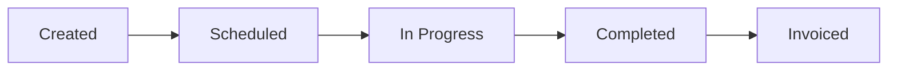

# Jobs

Jobs are the core of FieldCamp. A job represents a service request from a client — from initial quote through completion and invoicing.

## Job Lifecycle

## Creating a Job

Navigate to **Jobs → New Job** to create a new job.

### Required Fields
- **Client** — Select an existing client or create a new one
- **Description** — What work needs to be done
- **Service Type** — Category of service (plumbing, electrical, HVAC, etc.)

### Optional Fields
- **Location** — Service address (defaults to client's address)
- **Priority** — Low, Normal, High, or Urgent
- **Estimated Duration** — How long the job should take
- **Notes** — Internal notes for your team

## Assigning Jobs

Jobs can be assigned to technicians manually or via AI-powered dispatch.

### Manual Assignment
Select a technician from the **Assign To** dropdown when creating or editing a job.

### AI Dispatch
FieldCamp's AI dispatcher considers technician skills, location, and availability to suggest the best assignment.

## Job Status Updates

Technicians update job status from the mobile app:
- **En Route** — Heading to the job site
- **On Site** — Arrived and working
- **Completed** — Work finished
- **Needs Follow-up** — Additional work required

## Photos and Notes

Technicians can attach photos and notes to jobs — useful for documenting work, before/after shots, and issue reporting.
