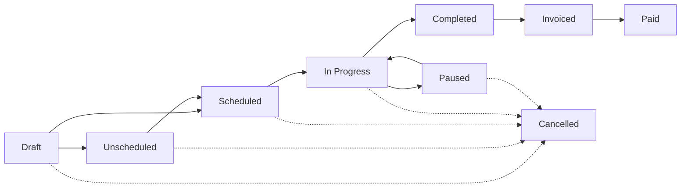

# Job Status Management

Job status tracks where a job is in its lifecycle — from initial creation to final payment. Understanding status transitions helps you manage workflow and automate processes.

<Info>
  **New to jobs?** Read [Jobs Overview](/features/jobs/overview) first to understand the basics.
</Info>

---

## Status Overview

Every job has one of nine possible statuses:

<CardGroup cols={3}>
  <Card title="Draft" icon="pencil">
    🔵 **Draft** — Job created but not ready to schedule
  </Card>
  
  <Card title="Scheduled" icon="calendar-check">
    🟦 **Scheduled** — Visit scheduled, tech assigned
  </Card>
  
  <Card title="Unscheduled" icon="calendar">
    🟨 **Unscheduled** — Ready to work but no visit date yet
  </Card>
  
  <Card title="In Progress" icon="play">
    🟩 **In Progress** — Tech is actively working on the job
  </Card>
  
  <Card title="Paused" icon="pause">
    🟧 **Paused** — Work temporarily stopped
  </Card>
  
  <Card title="Completed" icon="check-circle">
    🟩 **Completed** — Work finished, ready to invoice
  </Card>
  
  <Card title="Invoiced" icon="file-invoice">
    🟦 **Invoiced** — Invoice created and sent
  </Card>
  
  <Card title="Paid" icon="dollar-sign">
    🟢 **Paid** — Invoice fully paid, job closed
  </Card>
  
  <Card title="Cancelled" icon="ban">
    🔴 **Cancelled** — Job cancelled before completion
  </Card>
</CardGroup>

---

## Status Lifecycle

Jobs typically flow through statuses in this order:



<!-- Screenshot: status-lifecycle-flowchart.png — Visual flowchart showing all transitions -->

<Tip>
  **Pro tip:** Not all jobs go through every status. For example, a simple repair might go: Draft → Scheduled → In Progress → Completed → Invoiced → Paid.
</Tip>

---

## Status Definitions

### Draft

**When to use:**
- Job is newly created
- Still gathering information
- Waiting for client approval
- Pricing isn't finalized

**What happens in Draft:**
- Job is visible in the system but not assigned to techs
- No visits scheduled
- Items and pricing can be changed freely
- Client hasn't been notified

**How to move out of Draft:**
- Schedule a visit → status changes to **Scheduled**
- Mark as ready but don't schedule → change to **Unscheduled**
- Get client approval → change to **Unscheduled** or **Scheduled**

<!-- Screenshot: draft-status-badge.png — Draft status badge in job list -->

---

### Scheduled

**When to use:**
- At least one visit is scheduled
- Tech is assigned
- Client has been notified of appointment

**What happens in Scheduled:**
- Visit appears on calendar
- Tech sees job in mobile app
- Client gets confirmation SMS/email
- Visit reminders are sent (24 hours before, 1 hour before)

**Automatic transitions:**
- When visit time arrives → **In Progress** (if tech marks it)
- When visit is cancelled → back to **Unscheduled**

<Info>
  Learn more: [Creating Visits](/features/jobs/visits/creating-visits)
</Info>

<!-- Screenshot: scheduled-status-in-calendar.png — Job shown as scheduled on calendar -->

---

### Unscheduled

**When to use:**
- Job is approved and ready to work on
- But no specific date/time is set yet
- Waiting for client availability
- Waiting for tech availability

**What happens in Unscheduled:**
- Job appears in "Unscheduled Jobs" view
- Can be assigned to a tech but no visit date
- Useful for batch scheduling later

**How to move out of Unscheduled:**
- Schedule a visit → **Scheduled**

<Tip>
  **Pro tip:** Use the Unscheduled status for jobs that are "in the queue" but not yet time-sensitive.
</Tip>

<!-- Screenshot: unscheduled-view-filter.png — Filter showing unscheduled jobs -->

---

### In Progress

**When to use:**
- Tech has started working on the job
- Tech is on-site or actively working
- Work is underway

**What happens in In Progress:**
- Time tracking starts (if tech uses mobile app)
- Client can see "Tech is working on your job" status in portal
- Job appears in "Active Jobs" dashboard widget

**Automatic transitions:**
- When tech marks job complete → **Completed**
- When tech pauses work → **Paused**

<Info>
  Learn more: [Visit Status & Tracking](/features/jobs/visits/visit-status)
</Info>

<!-- Screenshot: in-progress-badge-mobile.png — In Progress status in mobile app -->

---

### Paused

**When to use:**
- Work has temporarily stopped
- Waiting for parts
- Waiting for client availability
- Weather delay
- Tech on lunch break

**What happens in Paused:**
- Time tracking pauses
- Job remains assigned to tech
- Client can see "Work paused" status in portal

**How to move out of Paused:**
- Tech resumes work → **In Progress**
- Work is cancelled → **Cancelled**
- Work is marked complete despite pause → **Completed**

<Tip>
  **Pro tip:** Use Paused for tracking downtime. It helps you understand how much time was spent on-site vs waiting.
</Tip>

<!-- Screenshot: pause-button-mobile.png — Pause button in mobile app visit detail -->

---

### Completed

**When to use:**
- All work is finished
- Tech has left the site
- Job is ready to be invoiced

**What happens in Completed:**
- Time tracking stops
- Final photos are uploaded
- Forms are submitted
- Client can see "Job complete" status
- Job appears in "Ready to Invoice" view

**Next steps:**
- Convert to invoice → **Invoiced**
- Mark as paid without invoice → **Paid**

<Info>
  Learn more: [Invoicing Integration](/features/jobs/invoicing-integration)
</Info>

<!-- Screenshot: completed-status-ready-to-invoice.png — Completed jobs in "Ready to Invoice" view -->

---

### Invoiced

**When to use:**
- Invoice has been created from the job
- Invoice has been sent to client

**What happens in Invoiced:**
- Invoice link is attached to job
- Client receives invoice via email/SMS
- Payment tracking begins
- Job appears in "Awaiting Payment" view

**Automatic transitions:**
- When payment received → **Paid**

<Warning>
  **Note:** If you edit the job items after invoicing, the invoice doesn't automatically update. You'll need to edit the invoice directly.
</Warning>

<!-- Screenshot: invoiced-status-with-link.png — Job detail showing linked invoice -->

---

### Paid

**When to use:**
- Invoice is fully paid
- Client has paid in full
- Job is closed

**What happens in Paid:**
- Job is marked as financially complete
- No further action needed
- Job appears in "Paid Jobs" view
- Revenue is counted in analytics

**This is the final status for successful jobs.**

<!-- Screenshot: paid-status-badge.png — Paid status badge with checkmark -->

---

### Cancelled

**When to use:**
- Client cancelled before work started
- Job was created in error
- Client no longer needs the service
- Work was cancelled mid-project

**What happens in Cancelled:**
- Scheduled visits are cancelled
- Techs are notified
- Client is notified (if desired)
- Job is removed from active lists (but still searchable)

**Cancelled jobs can include a reason:**
- Customer cancelled
- No longer needed
- Budget constraints
- Duplicate job
- Other (enter reason)

<Warning>
  **Cancelled is not the same as Deleted.** Cancelled jobs remain in the system for historical tracking.
</Warning>

<!-- Screenshot: cancel-job-modal.png — Cancel job modal with reason dropdown -->

---

## Status Transitions

Not all status changes are allowed. FieldCamp enforces logical transitions.

### Allowed Transitions

<Tabs>
  <Tab title="From Draft">
    ✅ **Draft** → **Unscheduled**
    ✅ **Draft** → **Scheduled** (when visit is scheduled)
    ✅ **Draft** → **Cancelled**
  </Tab>
  
  <Tab title="From Unscheduled">
    ✅ **Unscheduled** → **Scheduled** (when visit is scheduled)
    ✅ **Unscheduled** → **In Progress** (if tech starts work without scheduling)
    ✅ **Unscheduled** → **Cancelled**
  </Tab>
  
  <Tab title="From Scheduled">
    ✅ **Scheduled** → **In Progress** (when visit starts)
    ✅ **Scheduled** → **Unscheduled** (if visit is cancelled)
    ✅ **Scheduled** → **Cancelled**
  </Tab>
  
  <Tab title="From In Progress">
    ✅ **In Progress** → **Paused**
    ✅ **In Progress** → **Completed**
    ✅ **In Progress** → **Cancelled**
  </Tab>
  
  <Tab title="From Paused">
    ✅ **Paused** → **In Progress** (when work resumes)
    ✅ **Paused** → **Completed**
    ✅ **Paused** → **Cancelled**
  </Tab>
  
  <Tab title="From Completed">
    ✅ **Completed** → **Invoiced** (when invoice is created)
    ✅ **Completed** → **Paid** (if paid without invoice)
    ✅ **Completed** → **In Progress** (if rework is needed)
  </Tab>
  
  <Tab title="From Invoiced">
    ✅ **Invoiced** → **Paid** (when payment received)
    ✅ **Invoiced** → **Completed** (if invoice is deleted)
  </Tab>
  
  <Tab title="From Paid">
    ❌ **Paid** is final — no transitions allowed
    
    (You can reopen by changing status to Completed, but this requires manager/admin permissions)
  </Tab>
  
  <Tab title="From Cancelled">
    ✅ **Cancelled** → **Draft** (to reactivate)
    ✅ **Cancelled** → **Unscheduled** (to reactivate)
    
    <Warning>Reactivating a cancelled job requires confirmation.</Warning>
  </Tab>
</Tabs>

---

### Blocked Transitions

❌ You **cannot** jump directly from:
- **Draft** → **In Progress** (must schedule first)
- **Draft** → **Completed** (must do the work first)
- **Draft** → **Invoiced** (must complete work first)
- **Scheduled** → **Completed** (must go through In Progress)
- **Unscheduled** → **Completed** (must do the work first)

<Warning>
  **Why?** These transitions skip important steps in the workflow. FieldCamp enforces them to ensure data integrity and accurate time tracking.
</Warning>

---

## Changing Status Manually

### How to Change Status

<Steps>
  <Step title="Open Job Detail">
    Open the job you want to update.
  </Step>
  
  <Step title="Click Status Badge">
    Click the current status badge (in the sidebar or at the top).
  </Step>
  
  <Step title="Select New Status">
    Choose from the dropdown of allowed statuses.
  </Step>
  
  <Step title="Confirm (if required)">
    Some transitions (like Cancelled) require confirmation or a reason.
  </Step>
</Steps>

<!-- Screenshot: status-dropdown-change.png — Status dropdown showing available options -->

<Tip>
  **Pro tip:** You can also change status from the job list using bulk actions (select multiple jobs → **Change Status**).
</Tip>

---

## Automatic Status Changes

FieldCamp can automatically update job status based on certain events:

<AccordionGroup>
  <Accordion title="When a visit is scheduled">
    **Draft** or **Unscheduled** → **Scheduled**
    
    As soon as you schedule a visit, the job status updates automatically.
  </Accordion>
  
  <Accordion title="When a tech starts a visit">
    **Scheduled** → **In Progress**
    
    When a tech taps **Start Job** in the mobile app, status updates.
  </Accordion>
  
  <Accordion title="When a tech completes a visit">
    **In Progress** → **Completed**
    
    When a tech taps **Complete Job** and submits the visit log, status updates.
  </Accordion>
  
  <Accordion title="When an invoice is created">
    **Completed** → **Invoiced**
    
    When you click **Convert to Invoice**, status updates.
  </Accordion>
  
  <Accordion title="When payment is received">
    **Invoiced** → **Paid**
    
    When you record a payment that fully pays the invoice, status updates.
  </Accordion>
</AccordionGroup>

<Info>
  You can disable automatic status changes in [Settings → Jobs → Workflow](/settings/jobs).
</Info>

---

## Status-Based Permissions

Status affects what actions are allowed:

| Status | Can Edit Items? | Can Schedule Visits? | Can Delete? | Can Invoice? |
|--------|----------------|---------------------|-------------|-------------|
| **Draft** | ✅ Yes | ✅ Yes | ✅ Yes | ❌ No |
| **Scheduled** | ✅ Yes | ✅ Yes | ⚠️ Admin only | ❌ No |
| **In Progress** | ⚠️ Manager+ only | ⚠️ Reschedule only | ❌ No | ❌ No |
| **Completed** | ⚠️ Manager+ only | ❌ No | ❌ No | ✅ Yes |
| **Invoiced** | ❌ No | ❌ No | ❌ No | ❌ Already invoiced |
| **Paid** | ❌ No | ❌ No | ❌ No | ❌ Already invoiced |
| **Cancelled** | ❌ No | ❌ No | ✅ Yes | ❌ No |

<Warning>
  **Permissions vary by role.** Owners and Admins have more flexibility than Managers and Technicians.
</Warning>

---

## Status Filters & Views

### Filtering by Status

In the job list, filter by status to see:

<CardGroup cols={3}>
  <Card title="All Jobs" icon="list">
    Every job regardless of status
  </Card>
  
  <Card title="Active Jobs" icon="play">
    Scheduled + In Progress + Paused
  </Card>
  
  <Card title="Completed Jobs" icon="check">
    Completed only (ready to invoice)
  </Card>
  
  <Card title="Invoiced Jobs" icon="file-invoice">
    Invoiced only (awaiting payment)
  </Card>
  
  <Card title="Paid Jobs" icon="dollar-sign">
    Fully paid (closed)
  </Card>
  
  <Card title="Cancelled Jobs" icon="ban">
    Cancelled (historical)
  </Card>
</CardGroup>

<!-- Screenshot: status-filter-chips.png — Status filter chips at top of job list -->

---

### Saved Views by Status

Create saved views for common status combinations:

**Example views:**
- **"Ready to Invoice"** — Status: Completed, no invoice linked
- **"Overdue Jobs"** — Status: Scheduled, date < today, not completed
- **"In Progress Today"** — Status: In Progress, visit date = today
- **"Awaiting Payment"** — Status: Invoiced, balance > $0

<Info>
  Learn how to create saved views: [Saved Views](/features/saved-views)
</Info>

---

## Status Colors & Icons

Each status has a unique color and icon for quick recognition:

| Status | Color | Icon |
|--------|-------|------|
| **Draft** | 🔵 Blue | 📝 Pencil |
| **Scheduled** | 🟦 Light Blue | 📅 Calendar |
| **Unscheduled** | 🟨 Yellow | ⏳ Hourglass |
| **In Progress** | 🟩 Green | ▶️ Play |
| **Paused** | 🟧 Orange | ⏸️ Pause |
| **Completed** | 🟩 Dark Green | ✅ Check |
| **Invoiced** | 🟦 Blue | 📄 Invoice |
| **Paid** | 🟢 Bright Green | 💵 Dollar |
| **Cancelled** | 🔴 Red | 🚫 Ban |

<!-- Screenshot: status-badges-all.png — Grid showing all status badges with colors -->

<Tip>
  **Pro tip:** Status colors are consistent across the app — job list, calendar, mobile app, and reports.
</Tip>

---

## Status Reports & Analytics

Track job progress with status-based reports:

### Job Status Distribution

**Pie chart or bar chart showing:**
- How many jobs in each status
- Percentage of total

**Use cases:**
- Identify bottlenecks (too many jobs stuck in "Scheduled"?)
- Monitor completion rate (how many Completed vs In Progress?)

<!-- Screenshot: status-distribution-chart.png — Pie chart showing job count by status -->

---

### Status Transition Time

**Track how long jobs spend in each status:**

**Example metrics:**
- Average time from **Draft** → **Scheduled**: 2.5 days
- Average time from **Scheduled** → **Completed**: 4.3 days
- Average time from **Completed** → **Invoiced**: 1.2 days
- Average time from **Invoiced** → **Paid**: 18.5 days

**Use cases:**
- Identify delays (why are jobs stuck in Scheduled for 10 days?)
- Optimize workflows (speed up invoicing)

<!-- Screenshot: status-transition-report.png — Table showing average time in each status -->

<Info>
  Build custom reports in [Analytics](/features/analytics/overview).
</Info>

---

## Workflow Automation by Status

Automate actions based on status changes:

<AccordionGroup>
  <Accordion title="When job status changes to Scheduled">
    **Actions:**
    - Send confirmation SMS to client
    - Notify assigned tech via push notification
    - Add job to tech's mobile app schedule
  </Accordion>
  
  <Accordion title="When job status changes to In Progress">
    **Actions:**
    - Send "Tech is on the way" SMS to client
    - Start time tracking for tech
    - Log start time in visit log
  </Accordion>
  
  <Accordion title="When job status changes to Completed">
    **Actions:**
    - Auto-create invoice from job items
    - Send "Work complete" email to client
    - Notify manager for quality review
  </Accordion>
  
  <Accordion title="When job status changes to Paid">
    **Actions:**
    - Send thank-you email to client
    - Archive job (move to "Closed" folder)
    - Trigger follow-up task (schedule next maintenance visit)
  </Accordion>
</AccordionGroup>

<Info>
  Learn how to set up automations: [Workflow Automation](/features/workflow-automation/overview)
</Info>

<!-- Screenshot: workflow-example.png — Workflow showing "When status = Completed → Create Invoice" -->

---

## Troubleshooting

### I can't change status to "Completed"

**Possible causes:**
1. **Required forms not completed** — Check if the job has required forms that techs haven't submitted yet.
2. **Visit not marked complete** — If the visit is still "In Progress", you can't mark the job as Completed. Complete the visit first.
3. **Permissions** — Technicians may not have permission to mark jobs complete. Check role settings.

---

### Status changed but mobile app doesn't show it

**Solution:** Mobile app syncs every 5 minutes. Pull down to refresh manually, or wait for the next sync.

---

### Job is "Invoiced" but I want to edit items

**Solution:** You can't edit job items after invoicing (to prevent invoice/job mismatch). Edit the invoice directly instead.

If you need to change the job, delete the invoice first (this reverts status to Completed), then edit the job and re-create the invoice.

<Warning>
  Deleting an invoice that's already sent to the client may cause confusion. Communicate with the client first.
</Warning>

---

### Job is stuck in "In Progress" but tech finished hours ago

**Solution:** Tech forgot to mark the visit complete in the mobile app. You can manually complete the visit from the desktop:

1. Open the job
2. Go to **Visits** tab
3. Click the visit
4. Click **Mark Complete**

---

## Best Practices

### ✅ DO

<AccordionGroup>
  <Accordion title="Let status update automatically when possible">
    Don't manually change status if the system can do it automatically (e.g., scheduling a visit automatically changes to Scheduled).
  </Accordion>
  
  <Accordion title="Use Paused status to track downtime">
    If a tech is waiting for parts or client approval, mark it as Paused instead of leaving it In Progress. This gives you accurate time tracking.
  </Accordion>
  
  <Accordion title="Move jobs to Completed as soon as work is done">
    Don't let jobs sit in "In Progress" indefinitely. Mark them complete so they show up in "Ready to Invoice".
  </Accordion>
  
  <Accordion title="Use Cancelled with a reason">
    Always enter a cancellation reason (customer cancelled, duplicate, etc.) for historical tracking.
  </Accordion>
</AccordionGroup>

---

### ❌ DON'T

<AccordionGroup>
  <Accordion title="Don't skip statuses">
    Don't manually change Draft → Completed. Let jobs flow through the proper lifecycle.
  </Accordion>
  
  <Accordion title="Don't mark jobs as Completed if work isn't done">
    This messes up reporting and can lead to invoicing incomplete work.
  </Accordion>
  
  <Accordion title="Don't reopen Paid jobs unless absolutely necessary">
    Once a job is paid, it should stay closed. Reopening it can cause accounting issues.
  </Accordion>
</AccordionGroup>

---

## API: Update Job Status

Change job status programmatically via the API:

```bash
curl -X PUT "https://app.fieldcamp.ai/api/v1/jobs/507f1f77bcf86cd799439012" \
  -H "X-Api-Key: your_api_key" \
  -H "Content-Type: application/json" \
  -d '{
    "status": "Completed"
  }'
```

```json
// Response
{
  "success": true,
  "data": {
    "id": "507f1f77bcf86cd799439012",
    "jobNumber": "JOB-1234",
    "status": "Completed",
    "updatedAt": "2026-02-26T19:00:00Z"
  }
}
```

<Info>
  Full API reference: [Jobs API](/features/jobs/api)
</Info>

---

## What's Next?

<CardGroup cols={2}>
  <Card title="Visit Status & Tracking" icon="calendar-check" href="/features/jobs/visits/visit-status">
    Learn about visit-level status tracking
  </Card>
  
  <Card title="Workflow Automation" icon="bolt" href="/features/workflow-automation/overview">
    Automate actions based on status changes
  </Card>
  
  <Card title="Job Analytics" icon="chart-line" href="/features/analytics/jobs">
    Build reports on job status data
  </Card>
  
  <Card title="Job List & Views" icon="list" href="/features/jobs/job-list">
    Filter and organize jobs by status
  </Card>
</CardGroup>

---

## Related Articles

- [Jobs Overview](/features/jobs/overview) — Understand the basics
- [Creating Jobs](/features/jobs/creating-jobs) — How to create jobs
- [Job Detail Page](/features/jobs/job-detail) — Explore every tab
- [Invoicing Integration](/features/jobs/invoicing-integration) — Convert completed jobs to invoices

---

<Check>
  **You now know:** Every job status, the status lifecycle, allowed transitions, automatic status changes, permissions, filtering, and troubleshooting.
</Check>
