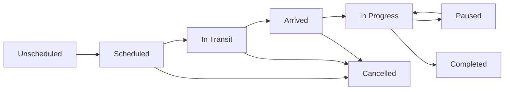

## What is a Visit?

A **visit** is a scheduled appointment where your team travels to a job site to perform work. While a [job](/features/jobs/overview) represents the entire scope of work for a client, a visit is the specific time block when a technician is on-site completing that work.

<CardGroup cols={2}>
  <Card title="Jobs" icon="briefcase">
    The overall work order - what needs to be done, items, pricing, client
  </Card>
  <Card title="Visits" icon="calendar-check">
    The scheduled appointment - when and who will do the work
  </Card>
</CardGroup>

### Key Distinction: Job vs Visit

Understanding the difference between jobs and visits is critical to using FieldCamp effectively:

| Aspect | Job | Visit |
|--------|-----|-------|
| **Purpose** | Defines WHAT work needs to be done | Defines WHEN and WHO does the work |
| **Relationship** | One job can have multiple visits | Each visit belongs to one job |
| **Status** | Draft → Scheduled → In Progress → Completed → Invoiced | Scheduled → In Transit → In Progress → Completed |
| **Components** | Items, pricing, client, forms, photos | Date/time, assigned techs, logs, time tracking |
| **Example** | "Replace HVAC system at 123 Main St" | "Monday 10am-12pm: John installs unit" |

<Note>
**Common scenario:** An HVAC installation job might have 3 visits:
1. Initial inspection visit (1 hour)
2. Equipment installation visit (4 hours)
3. Final inspection and testing visit (1 hour)
</Note>

---

## Visit Lifecycle

Every visit progresses through a series of statuses from scheduling to completion:

### Visit Statuses Explained

<AccordionGroup>
  <Accordion title="Unscheduled" icon="clock">
    **Definition:** Job approved but no visit has been scheduled yet.
    
    **What it means:** The job is ready to be assigned and scheduled, but no tech or time slot has been selected.
    
    **Next actions:**
    - Schedule a visit from the [calendar](/features/jobs/scheduling/calendar)
    - Use [AI Dispatcher](/features/jobs/ai-dispatcher) to find the best tech
    - Assign manually from job detail page
    
    **Who sees it:** Office staff, dispatchers, managers
  </Accordion>

  <Accordion title="Scheduled" icon="calendar">
    **Definition:** Visit has been scheduled with a date, time, and assigned technician.
    
    **What it means:** 
    - Tech has been notified
    - Time slot reserved on calendar
    - Customer confirmation sent (if enabled)
    
    **Automatic triggers:**
    - Customer receives confirmation email/SMS
    - Tech receives calendar notification
    - Visit appears on mobile app schedule
    
    **Next status:** In Transit (manual) or auto-triggered by GPS
  </Accordion>

  <Accordion title="In Transit" icon="car">
    **Definition:** Technician is traveling to the job site.
    
    **What it means:**
    - Tech has left their current location
    - Estimated arrival time calculated
    - Customer can track progress (if enabled)
    
    **How status changes:**
    - **Manual:** Tech taps "Start Travel" in mobile app
    - **Automatic:** GPS detects tech leaving previous job location (optional)
    
    **Automatic triggers:**
    - Customer receives "Tech is on the way" notification
    - Travel time tracking starts
    - Mileage tracking begins (GPS)
  </Accordion>

  <Accordion title="Arrived" icon="location-dot">
    **Definition:** Technician has arrived at the job site.
    
    **What it means:**
    - Tech is within geofence radius of job address (typically 200 meters)
    - Customer knows tech is on-site
    
    **How status changes:**
    - **Manual:** Tech taps "Arrive" in mobile app
    - **Automatic:** GPS detects tech entering job site geofence
    
    **Automatic triggers:**
    - Customer receives "Tech arrived" notification
    - Travel time ends
    - Arrival timestamp recorded
  </Accordion>

  <Accordion title="In Progress" icon="wrench">
    **Definition:** Technician is actively working on the job.
    
    **What it means:**
    - Work has started
    - Time tracking is running
    - Tech can log materials, photos, notes
    
    **How status changes:**
    - Tech taps "Start Job" in mobile app
    - Automatic timer starts
    
    **Automatic triggers:**
    - Work timer starts (billable hours tracking)
    - Job appears as "active" on dispatch board
    - Office can see real-time progress
  </Accordion>

  <Accordion title="Paused" icon="pause">
    **Definition:** Work temporarily stopped (lunch break, waiting for parts, etc.)
    
    **What it means:**
    - Timer paused (non-billable time)
    - Tech still on-site or temporarily left
    
    **Common reasons:**
    - Lunch break
    - Waiting for parts delivery
    - Waiting for client approval
    - Weather delay
    
    **How to resume:** Tech taps "Resume Work" → returns to In Progress
  </Accordion>

  <Accordion title="Completed" icon="circle-check">
    **Definition:** Work is finished, customer signed off.
    
    **What it means:**
    - All tasks completed
    - Customer signature captured (if required)
    - Photos and forms submitted
    - Time and materials logged
    
    **What happens next:**
    - Visit logs are finalized
    - Job status may update to Completed (if all visits done)
    - Invoice can be generated
    - Customer receives completion notification
    
    **Required to complete:**
    - All required forms filled
    - Customer signature (if enabled)
    - Photos uploaded (if required)
    - Time log finalized
  </Accordion>

  <Accordion title="Cancelled" icon="circle-xmark">
    **Definition:** Visit was cancelled and did not occur.
    
    **Reasons:**
    - Customer requested reschedule
    - Weather/emergency
    - Tech unavailable
    - Parts not available
    
    **What happens:**
    - Time slot freed on calendar
    - Customer notified (optional)
    - Job remains open (can schedule new visit)
    - Cancellation reason recorded
  </Accordion>
</AccordionGroup>

---

## Visit Components

Every visit contains the following information:

<CardGroup cols={2}>
  <Card title="Schedule Details" icon="calendar-days">
    - Date and time (start/end)
    - Duration estimate
    - Arrival window (e.g., 10am-12pm)
    - Recurring pattern (if applicable)
  </Card>

  <Card title="Assignment" icon="user-group">
    - Assigned technicians (one or more)
    - Required skills
    - Required equipment
    - Team availability check
  </Card>

  <Card title="Location" icon="map-pin">
    - Job address (default)
    - Custom address (override)
    - GPS coordinates
    - Driving directions link
  </Card>

  <Card title="Work Logs" icon="clipboard-list">
    - Time tracking (travel, work, breaks)
    - Mileage tracking (GPS)
    - Materials used
    - Photos (before/during/after)
  </Card>

  <Card title="Forms & Checklists" icon="list-check">
    - Service checklists
    - Inspection forms
    - Safety checklists
    - Customer surveys
  </Card>

  <Card title="Customer Interaction" icon="handshake">
    - Visit notes
    - Customer comments
    - Digital signatures
    - Approval/sign-off
  </Card>
</CardGroup>

---

## Visit Types

FieldCamp supports different types of visits for various service scenarios:

### Service Visit
**Purpose:** Standard service call to perform work
**Duration:** 1-4 hours typical
**Examples:** Repair appliance, routine maintenance, system tune-up

### Inspection Visit
**Purpose:** Site assessment before work begins
**Duration:** 30-60 minutes typical
**Examples:** Quote walk-through, equipment evaluation, safety inspection

### Installation Visit
**Purpose:** Install new equipment or systems
**Duration:** 2-8 hours typical
**Examples:** HVAC installation, equipment replacement, new system setup

### Follow-up Visit
**Purpose:** Return to complete work or check previous work
**Duration:** 1-2 hours typical
**Examples:** Fix issues found during QA, complete partial job, warranty service

### Emergency Visit
**Purpose:** Urgent same-day service
**Duration:** Variable
**Examples:** No heat in winter, water leak, equipment failure

<Tip>
**Pro tip:** Use visit types to:
- Filter calendar views by visit type
- Track metrics (average duration per type)
- Apply different pricing (emergency surcharge)
- Customize customer notifications
</Tip>

---

## Single vs Multiple Visits Per Job

Jobs can have one or many visits depending on the scope of work:

### Single Visit Jobs

Most jobs are completed in one visit. This is typical for:
- Basic repairs (30 min - 2 hours)
- Routine maintenance
- Inspections
- Small installations

**Workflow:**
1. Create job
2. Schedule visit
3. Tech completes work
4. Job marked complete
5. Invoice sent

### Multi-Visit Jobs

Complex jobs may require multiple visits:

<AccordionGroup>
  <Accordion title="Sequential Visits (One After Another)">
    **Example:** HVAC replacement
    - **Visit 1:** Inspection and measurements (1 hour)
    - **Visit 2:** Remove old unit, prep site (3 hours)
    - **Visit 3:** Install new unit (4 hours)
    - **Visit 4:** Final inspection and testing (1 hour)
    
    **Status:** Each visit must complete before next is scheduled
  </Accordion>

  <Accordion title="Recurring Visits (Repeating Schedule)">
    **Example:** Pool maintenance contract
    - Visit every 2 weeks for weekly cleaning
    - Same tech, same duration
    - Auto-scheduled for entire year
    
    **Status:** All visits pre-scheduled, auto-complete individually
    
    Learn more: [Recurring Visits](/features/jobs/visits/recurring-visits)
  </Accordion>

  <Accordion title="Parallel Visits (Multiple Techs)">
    **Example:** Large commercial installation
    - **Visit 1:** Electrician runs wiring (4 hours)
    - **Visit 2:** HVAC tech installs unit (4 hours, same day)
    - **Visit 3:** Both techs test and finalize (2 hours)
    
    **Status:** Multiple techs working simultaneously or overlapping
  </Accordion>
</AccordionGroup>

---

## Visit Notifications

FieldCamp automatically notifies customers and team members at key visit milestones:

### Customer Notifications

| Event | Timing | Channels | Customizable? |
|-------|--------|----------|---------------|
| Visit scheduled | Immediately after scheduling | Email, SMS | ✅ Yes |
| Reminder | 24 hours before visit | Email, SMS | ✅ Yes |
| Tech on the way | When status → In Transit | SMS, Push | ✅ Yes |
| Tech arrived | When status → Arrived | SMS, Push | ✅ Yes |
| Work completed | When status → Completed | Email, SMS | ✅ Yes |
| Reschedule/cancel | When visit changed | Email, SMS | ✅ Yes |

### Team Notifications

| Event | Who | Channels | Customizable? |
|-------|-----|----------|---------------|
| Visit assigned | Assigned tech(s) | Email, Mobile Push, Calendar | ✅ Yes |
| Visit changed | Assigned tech(s) | Email, Mobile Push | ✅ Yes |
| Visit starting soon | Assigned tech(s) | Mobile Push | ✅ Yes (set reminder time) |
| Visit overdue | Assigned tech, Manager | Email, Mobile Push | ✅ Yes |
| Visit completed | Manager, Office staff | Email | ✅ Yes |

<Note>
Configure notification preferences in **Settings → Notifications → Visit Notifications**
</Note>

---

## Visit Permissions

Control who can perform visit actions based on roles:

### View Visits

| Role | Permissions |
|------|-------------|
| **Admin** | View all visits across organization |
| **Manager** | View all visits for assigned teams |
| **Dispatcher** | View all visits (scheduling access) |
| **Technician** | View own assigned visits only |
| **Office Staff** | View all visits (read-only) |
| **Client** | View own visits via client portal |

### Create/Edit Visits

| Action | Who Can Do It |
|--------|---------------|
| **Schedule new visit** | Admin, Manager, Dispatcher |
| **Reschedule visit** | Admin, Manager, Dispatcher |
| **Reassign tech** | Admin, Manager, Dispatcher |
| **Cancel visit** | Admin, Manager, Dispatcher |
| **Update visit status** | Assigned tech (mobile app), Admin, Manager |
| **Edit visit logs** | Assigned tech (mobile app), Admin, Manager |
| **View visit history** | Admin, Manager |

<Warning>
**Important:** Technicians cannot reschedule their own visits from the mobile app. This prevents conflicts and ensures dispatch has visibility on schedule changes.
</Warning>

---

## Mobile vs Web Workflows

Visit functionality differs between mobile and web platforms:

### Mobile App (Technician)

<CardGroup cols={1}>
  <Card title="Primary Use Case: Complete Visits On-Site" icon="mobile">
    **What techs do on mobile:**
    - View today's schedule
    - Navigate to job site (GPS)
    - Update visit status (In Transit → Arrived → In Progress → Completed)
    - Log time (auto-start/stop timers)
    - Track mileage (automatic GPS)
    - Take photos (before/during/after)
    - Fill out forms/checklists
    - Add materials used
    - Capture customer signature
    - Add notes
    
    **Cannot do on mobile:**
    - Schedule new visits (dispatcher only)
    - Reschedule visits (must request via office)
    - View other techs' schedules
    - Edit pricing or job items
  </Card>
</CardGroup>

### Web App (Office/Dispatcher)

<CardGroup cols={1}>
  <Card title="Primary Use Case: Schedule & Monitor Visits" icon="desktop">
    **What dispatchers do on web:**
    - View calendar (all techs, all jobs)
    - Schedule new visits
    - Reschedule/cancel visits (drag-and-drop)
    - Assign/reassign techs
    - Check team availability
    - Optimize routes (AI-based)
    - Monitor visit status (real-time)
    - Review completed visit logs
    - Generate reports
    - Bulk operations (schedule multiple visits)
    
    **Cannot do on web:**
    - Capture customer signature (mobile only)
    - Auto-track GPS mileage (mobile only)
    - Take photos with site context (mobile preferred)
  </Card>
</CardGroup>

---

## Key Concepts Summary

<CardGroup cols={2}>
  <Card title="Visit = Appointment" icon="calendar-check">
    A visit is a scheduled time block when a tech goes on-site to work on a job.
  </Card>

  <Card title="One Job, Many Visits" icon="list">
    Complex jobs can be broken into multiple visits (inspection → install → test).
  </Card>

  <Card title="Status Tracking" icon="timeline">
    Visits progress through statuses: Scheduled → In Transit → Arrived → In Progress → Completed.
  </Card>

  <Card title="Time & Mileage Tracking" icon="stopwatch">
    Automatic tracking of travel time, work time, and GPS mileage for accurate billing.
  </Card>

  <Card title="Mobile-First for Techs" icon="mobile-screen">
    Technicians use mobile app on-site to update status, log time, take photos, and capture signatures.
  </Card>

  <Card title="Web-First for Dispatchers" icon="calendar-days">
    Office staff and dispatchers use web calendar to schedule, assign, and monitor visits.
  </Card>
</CardGroup>

---

## Next Steps

<CardGroup cols={2}>
  <Card title="Create a Visit" icon="plus" href="/features/jobs/visits/creating-visits">
    Learn how to schedule visits from the calendar or job detail page
  </Card>

  <Card title="Track Visit Status" icon="location-crosshairs" href="/features/jobs/visits/visit-status">
    Understand visit statuses and how they update (manual vs automatic)
  </Card>

  <Card title="Log Time & Materials" icon="clipboard-list" href="/features/jobs/visits/visit-logs">
    Track travel, work time, mileage, materials, and photos for each visit
  </Card>

  <Card title="Set Up Recurring Visits" icon="repeat" href="/features/jobs/visits/recurring-visits">
    Create maintenance contracts with auto-scheduled recurring visits
  </Card>

  <Card title="View Calendar" icon="calendar" href="/features/jobs/scheduling/calendar">
    See all visits in calendar view, filter by tech, and drag-and-drop reschedule
  </Card>

  <Card title="Optimize Routes" icon="route" href="/features/jobs/scheduling/route-optimization">
    Use AI to optimize tech routes and minimize drive time
  </Card>
</CardGroup>

---

## Related Resources

<CardGroup cols={3}>
  <Card title="Jobs Overview" icon="briefcase" href="/features/jobs/overview">
    Understand jobs (the work) vs visits (the appointments)
  </Card>

  <Card title="Job Detail Page" icon="file-lines" href="/features/jobs/job-detail">
    View all visits for a job in the Visits tab
  </Card>

  <Card title="Mobile App" icon="mobile" href="/mobile/overview">
    How technicians use the mobile app to complete visits
  </Card>

  <Card title="Customer Notifications" icon="bell" href="/features/notifications/customer">
    Customize visit notifications sent to customers
  </Card>

  <Card title="Team Management" icon="users" href="/features/team/overview">
    Manage tech availability, skills, and assignments
  </Card>

  <Card title="API: Visits" icon="code" href="/api/visits">
    Programmatically create and update visits via REST API
  </Card>
</CardGroup>
