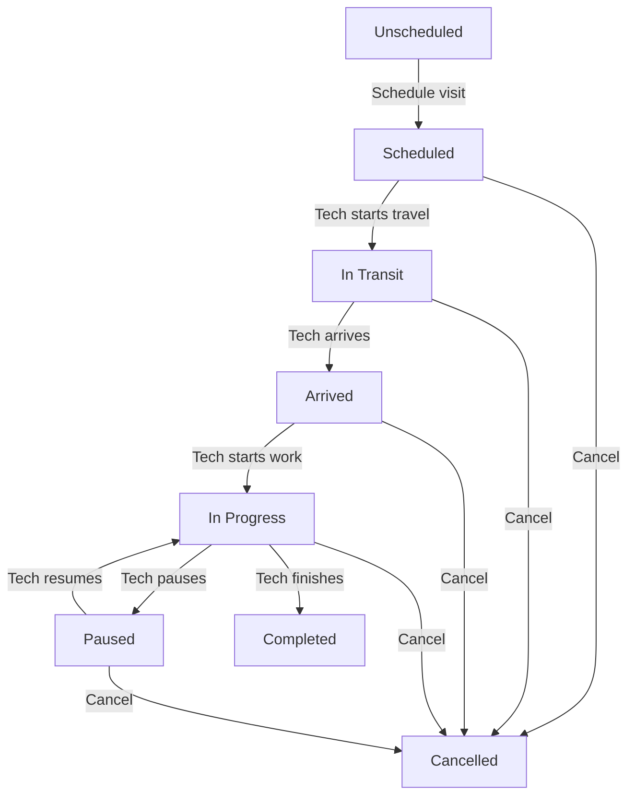

## Visit Status Lifecycle

Every visit progresses through a series of statuses that track its progress from scheduling to completion. Understanding these statuses helps you monitor technician activity, communicate with customers, and ensure jobs are completed on time.



---

## Status Definitions

<AccordionGroup>
  <Accordion title="Unscheduled" icon="clock" defaultOpen>
    **Definition:** Job approved but no visit has been scheduled yet.
    
    **Who sees it:** Office staff, dispatchers, managers
    
    **Duration:** Until a visit is scheduled (can remain unscheduled indefinitely)
    
    **Actions available:**
    - Schedule visit (from calendar or job page)
    - Use AI Dispatcher to find best tech
    - Convert to estimate (if job not yet approved)
    
    **Customer notification:** None (customer doesn't know about unscheduled jobs)
    
    **Best practices:**
    - Don't leave jobs unscheduled for too long (customer expectation is 1-2 business days)
    - Priority jobs should be scheduled within 24 hours
    - Use "Unscheduled" filter to see jobs needing attention
  </Accordion>

  <Accordion title="Scheduled" icon="calendar">
    **Definition:** Visit has been scheduled with a date, time, and assigned technician.
    
    **Who sees it:** Tech (mobile app), office staff, customer (portal/email)
    
    **Duration:** From when visit is scheduled until tech starts traveling (can be hours, days, or weeks)
    
    **What happens automatically:**
    - ✅ Tech receives calendar notification (email + mobile push)
    - ✅ Customer receives confirmation (email/SMS, if enabled)
    - ✅ Visit appears on tech's mobile app schedule
    - ✅ Job status updates to "Scheduled" (if previously unscheduled)
    - ✅ Reminder sent 24 hours before visit (configurable)
    
    **Actions available:**
    - Reschedule visit (drag-and-drop in calendar)
    - Reassign to different tech
    - Cancel visit
    - Send reminder to tech or customer
    
    **Automatic transitions:**
    - **Manual:** Tech taps "Start Travel" in mobile app → changes to "In Transit"
    - **GPS-based:** If enabled, auto-changes to "In Transit" when tech's GPS location starts moving toward job site
  </Accordion>

  <Accordion title="In Transit" icon="car">
    **Definition:** Technician is traveling to the job site.
    
    **Who sees it:** Tech (mobile app), office staff, customer (tracking link, if enabled)
    
    **Duration:** From when tech starts traveling until they arrive on-site (typically 10-30 minutes)
    
    **What happens automatically:**
    - ✅ Customer receives "Tech is on the way" notification (SMS/email, if enabled)
    - ✅ Travel time tracking starts
    - ✅ Mileage tracking begins (GPS odometer)
    - ✅ ETA calculated and shared with customer (Google Maps)
    - ✅ Office can see tech's live location (if GPS enabled)
    
    **Actions available (tech mobile app):**
    - Call customer (tap phone number)
    - Navigate to job site (Google Maps integration)
    - Mark as "Arrived" when on-site
    - Cancel visit (with reason)
    
    **Actions available (office):**
    - Monitor ETA
    - Send message to tech
    - Call tech if delayed
    
    **Automatic transitions:**
    - **Manual:** Tech taps "Arrive" in mobile app → changes to "Arrived"
    - **GPS-based:** If geofencing enabled, auto-changes to "Arrived" when tech enters 200-meter radius of job address
    
    <Tip>
    **Pro tip:** Enable GPS-based status changes to reduce manual tapping for techs. They'll automatically transition to "Arrived" when on-site.
    
    Configure: **Settings → Mobile App → Auto-Status Updates → Geofencing Enabled**
    </Tip>
  </Accordion>

  <Accordion title="Arrived" icon="location-dot">
    **Definition:** Technician has arrived at the job site.
    
    **Who sees it:** Tech, office staff, customer (notification)
    
    **Duration:** From arrival until tech starts working (typically 1-5 minutes for prep)
    
    **What happens automatically:**
    - ✅ Customer receives "Tech arrived" notification (SMS/email, if enabled)
    - ✅ Travel time ends, total travel time logged
    - ✅ Arrival timestamp recorded (used for time tracking and SLA reporting)
    - ✅ Mileage tracking stops, total mileage logged
    
    **Actions available (tech mobile app):**
    - Start job (changes to "In Progress")
    - Contact customer (call or text)
    - Review job details (items, notes, forms)
    - Take "before" photos
    
    **Why this status exists:**
    - **Customer communication:** Lets customer know tech is on-site (reduces "where are they?" calls)
    - **Time tracking:** Separates travel time from work time (for billing)
    - **Preparation:** Gives tech a moment to review job, gather tools, meet customer
    
    **Automatic transitions:**
    - **Manual:** Tech taps "Start Job" → changes to "In Progress"
  </Accordion>

  <Accordion title="In Progress" icon="wrench">
    **Definition:** Technician is actively working on the job.
    
    **Who sees it:** Tech, office staff
    
    **Duration:** From when work starts until work is complete (minutes to hours, depending on job)
    
    **What happens automatically:**
    - ✅ Work timer starts (billable hours tracking)
    - ✅ Job appears as "active" on dispatch board (office can see who's working)
    - ✅ Real-time work duration displayed on mobile app
    
    **Actions available (tech mobile app):**
    - **Log time:** Timer runs automatically, but can be manually adjusted
    - **Add materials:** Log products/parts used
    - **Take photos:** During-work and after photos
    - **Fill forms:** Complete service checklists, safety forms
    - **Add notes:** Internal notes for office or customer-facing notes
    - **Pause work:** If break or waiting for parts (changes to "Paused")
    - **Complete job:** When work is done (changes to "Completed")
    
    **Actions available (office):**
    - Monitor work duration (check if job is taking longer than estimated)
    - Send message to tech (e.g., "Customer called with question")
    - View real-time updates (photos, forms submitted)
    
    **Automatic transitions:**
    - **Manual:** Tech taps "Pause" → changes to "Paused"
    - **Manual:** Tech taps "Complete Job" → changes to "Completed"
  </Accordion>

  <Accordion title="Paused" icon="pause">
    **Definition:** Work temporarily stopped (lunch break, waiting for parts, customer approval, etc.)
    
    **Who sees it:** Tech, office staff
    
    **Duration:** From when work is paused until resumed (minutes to hours)
    
    **What happens automatically:**
    - ✅ Work timer pauses (non-billable time)
    - ✅ Pause reason recorded (selected by tech from dropdown)
    - ✅ Pause start time logged
    
    **Common pause reasons:**
    - **Lunch break** (30-60 minutes, non-billable)
    - **Waiting for parts** (ordering or picking up parts)
    - **Waiting for customer approval** (e.g., additional work needed, cost increased)
    - **Weather delay** (outdoor work interrupted by rain)
    - **Equipment issue** (tech's tools/vehicle need repair)
    - **Other** (custom reason)
    
    **Actions available (tech mobile app):**
    - Resume work (changes to "In Progress")
    - Add note explaining pause reason
    - Cancel visit (if unable to complete)
    
    **Actions available (office):**
    - Contact tech to check status
    - Reschedule if pause is extended
    - Approve additional work (if customer approval needed)
    
    **Automatic transitions:**
    - **Manual:** Tech taps "Resume" → changes back to "In Progress"
    
    <Note>
    **Time tracking:** Paused time is **not billable** by default. If a pause should be billable (e.g., waiting for customer-provided equipment), mark it as "Billable Wait Time" in the pause settings.
    </Note>
  </Accordion>

  <Accordion title="Completed" icon="circle-check">
    **Definition:** Work is finished, customer signed off, and tech has left the site.
    
    **Who sees it:** Everyone (tech, office, customer)
    
    **Duration:** Permanent (visit does not change status after completion)
    
    **What happens automatically:**
    - ✅ Work timer stops, total work time logged
    - ✅ Visit logs finalized (time, mileage, materials, photos)
    - ✅ Customer receives "Job completed" notification (email/SMS, if enabled)
    - ✅ Job status may update to "Completed" (if all visits for this job are done)
    - ✅ Invoice can be generated (office can convert job → invoice)
    
    **Requirements to mark as completed:**
    - All required forms filled out (if any)
    - Customer signature captured (if enabled for this job type)
    - Photos uploaded (if required)
    - Time and materials logged
    
    **Actions available (office):**
    - Review visit logs (time, mileage, materials, photos, forms)
    - Edit visit logs (if corrections needed)
    - Generate invoice (convert job items + visit logs → invoice)
    - Schedule follow-up visit (if needed)
    - Export visit data (CSV, PDF report)
    
    **Actions available (tech mobile app):**
    - View completed visit (read-only)
    - Edit visit logs (if edit window hasn't closed - typically 24 hours)
    
    <Warning>
    **Edit window:** By default, techs can edit completed visit logs for 24 hours after completion. After that, only managers/admins can edit (prevents retroactive time changes).
    
    Configure: **Settings → Visits → Edit Window After Completion**
    </Warning>
  </Accordion>

  <Accordion title="Cancelled" icon="circle-xmark">
    **Definition:** Visit was cancelled and did not occur.
    
    **Who sees it:** Tech (notification), office staff, customer (notification, if sent)
    
    **Duration:** Permanent (cancelled visits remain in history but don't count toward completion)
    
    **Common reasons for cancellation:**
    - **Customer requested reschedule** (weather, emergency, scheduling conflict)
    - **Tech unavailable** (sick, vehicle breakdown, emergency)
    - **Parts not available** (can't complete without necessary parts)
    - **Job cancelled** (customer no longer wants service)
    - **Duplicate visit** (accidentally scheduled twice)
    
    **What happens automatically:**
    - ✅ Visit removed from tech's schedule (frees up time slot)
    - ✅ Customer notified (optional - "Your visit has been cancelled")
    - ✅ Tech notified (mobile push + email)
    - ✅ Cancellation reason and timestamp recorded
    - ✅ Job status remains "Unscheduled" or "Scheduled" (depending on other visits)
    
    **Actions available:**
    - Reschedule visit (creates new visit for same job)
    - View cancellation reason and who cancelled it
    
    <Tip>
    **Best practice:** When cancelling a visit, always:
    1. Select a cancellation reason (for reporting)
    2. Add a note explaining why (for team context)
    3. Immediately reschedule (if customer still wants service)
    4. Notify customer personally (call or text) for high-value jobs
    </Tip>
  </Accordion>
</AccordionGroup>

---

## Status Transitions: Who Can Change Status?

Different roles have different permissions to update visit status:

### Manual Status Changes (Desktop/Web App)

| From Status | To Status | Who Can Change |
|-------------|-----------|----------------|
| Unscheduled | Scheduled | Dispatcher, Manager, Admin |
| Scheduled | In Transit | Admin, Manager (manual override only - usually tech does this) |
| In Transit | Arrived | Admin, Manager (manual override only) |
| Arrived | In Progress | Admin, Manager (manual override only) |
| In Progress | Paused | Admin, Manager (manual override only) |
| Paused | In Progress | Admin, Manager (manual override only) |
| In Progress | Completed | Admin, Manager (can force-complete) |
| Any status | Cancelled | Admin, Manager, Dispatcher |

<Note>
**Why limited permissions?** 
- Techs control their own workflow via mobile app (prevents office interference)
- Office can override in emergencies (tech's phone died, tech forgot to update)
- Prevents accidental status changes (drag-and-drop in calendar doesn't change status)
</Note>

### Automatic Status Changes (Mobile App - Technician)

| From Status | To Status | How Tech Updates |
|-------------|-----------|------------------|
| Scheduled | In Transit | Tap "Start Travel" button |
| In Transit | Arrived | Tap "Arrive" button (or auto-detect via GPS) |
| Arrived | In Progress | Tap "Start Job" button |
| In Progress | Paused | Tap "Pause" button → select reason |
| Paused | In Progress | Tap "Resume" button |
| In Progress | Completed | Tap "Complete Job" → submit forms/signature |

---

## GPS-Based Auto-Status Updates

FieldCamp can automatically update visit status based on technician GPS location:

### How It Works

<Steps>
  <Step title="Tech Enables GPS on Mobile App">
    Tech opens FieldCamp mobile app → Grants location permission (iOS/Android)
    
    **Location accuracy:**
    - **High accuracy (GPS + WiFi + Cellular):** Recommended for auto-status
    - **Battery saver (Network only):** Less accurate, may miss geofence
    - **Off:** Manual status updates only
  </Step>

  <Step title="System Creates Geofence Around Job Address">
    For each scheduled visit, FieldCamp creates an invisible "geofence" (circular radius) around the job address:
    
    - **Default radius:** 200 meters (~650 feet)
    - **Adjustable:** 100m (tight urban areas) to 500m (rural/large properties)
    
    Configure: **Settings → Mobile App → Geofence Radius**
  </Step>

  <Step title="Tech Approaches Job Site">
    As tech drives/walks toward job site:
    
    - **5+ miles away:** Status remains "Scheduled" or "In Transit" (manual)
    - **1 mile away:** System prepares for arrival detection
    - **Crosses geofence boundary:** Auto-triggers status change
  </Step>

  <Step title="Auto-Status Triggers">
    **When tech enters geofence:**
    - Status: "In Transit" → "Arrived"
    - Notification: Customer receives "Tech arrived" SMS/email
    - Timestamp: Arrival time recorded
    
    **When tech exits geofence:**
    - If status was "Arrived" or "In Progress" and NOT marked completed → No auto-change (tech may step away temporarily)
    - If status was "Completed" → No change (visit finished)
  </Step>
</Steps>

### Configuration Options

Navigate to **Settings → Mobile App → Auto-Status Updates**

| Setting | Options | Default | Recommended |
|---------|---------|---------|-------------|
| **Enable geofencing** | On/Off | On | On (for automatic arrival detection) |
| **Geofence radius** | 100m, 200m, 300m, 500m | 200m | 200m (most accurate) |
| **Auto-mark Arrived** | On/Off | On | On (reduces manual tapping) |
| **Auto-start In Transit** | On/Off | Off | Off (requires manual confirmation) |
| **Require WiFi/GPS** | On/Off | On | On (prevents false positives from cell tower triangulation) |

<Warning>
**Privacy note:** GPS tracking only occurs when the tech has an active visit scheduled. Location is NOT tracked during off-hours or personal time.

Techs can disable GPS at any time (but will need to manually update status).
</Warning>

---

## Status-Based Customer Notifications

Customers receive automatic notifications at key visit milestones:

### Default Notification Settings

| Event | Timing | Default Channel | Customizable Message? |
|-------|--------|-----------------|----------------------|
| **Visit scheduled** | Immediately after scheduling | Email + SMS | ✅ Yes |
| **Reminder** | 24 hours before visit | Email + SMS | ✅ Yes |
| **Tech on the way** | Status → In Transit | SMS only | ✅ Yes |
| **Tech arrived** | Status → Arrived | SMS only | ✅ Yes |
| **Work completed** | Status → Completed | Email + SMS | ✅ Yes |
| **Visit cancelled** | When cancelled | Email + SMS | ✅ Yes |
| **Visit rescheduled** | When rescheduled | Email + SMS | ✅ Yes |

### Customizing Notification Messages

Navigate to **Settings → Notifications → Visit Notifications → Edit Templates**

**Example: "Tech on the way" SMS**

**Default message:**
```
Hi [Customer Name], [Tech Name] is on the way to your property at [Address]. 
Estimated arrival: [ETA]. Track: [Tracking Link]
```

**Customized message:**
```
Good news! Your technician [Tech Name] is heading your way 🚗
ETA: [ETA]
Questions? Call/text [Tech Phone]
Live tracking: [Tracking Link]
- [Company Name]
```

**Available variables:**
- `[Customer Name]`, `[Tech Name]`, `[Tech Phone]`
- `[Address]`, `[City]`, `[Date]`, `[Time]`
- `[ETA]`, `[Tracking Link]`, `[Company Name]`

<Tip>
**Pro tip:** Include a tracking link so customers can see tech's live location and ETA:

Enable: **Settings → Customer Portal → Enable Visit Tracking**

Customers click the link and see a map showing:
- Tech's current location (live GPS)
- Estimated arrival time (Google Maps traffic-adjusted)
- Tech's photo and contact info
</Tip>

---

## Status Colors & Icons

Visual indicators help you quickly identify visit status:

| Status | Color | Icon | Where You See It |
|--------|-------|------|------------------|
| **Unscheduled** | Gray | 🕒 | Job list, job detail page |
| **Scheduled** | Blue | 📅 | Calendar, job list, mobile app |
| **In Transit** | Yellow | 🚗 | Calendar, dispatch board, mobile app |
| **Arrived** | Orange | 📍 | Dispatch board, mobile app |
| **In Progress** | Green | 🔧 | Calendar, dispatch board, mobile app |
| **Paused** | Light Orange | ⏸️ | Mobile app, dispatch board |
| **Completed** | Dark Green | ✅ | Calendar, job list, reports |
| **Cancelled** | Red | ❌ | Job history, reports |

### Color Customization

Customize status colors to match your brand or preferences:

Navigate to **Settings → Appearance → Visit Status Colors**

---

## Status-Based Filtering & Reporting

Use visit status to filter and analyze performance:

### Filtering Visits by Status

**From Calendar:**
- Click **Filter** icon → Select status(es)
- Example: Show only "In Progress" visits to see who's working right now

**From Jobs List:**
- Filter by job status: "Scheduled" (has upcoming visit) or "Unscheduled" (needs scheduling)

**From Dispatch Board:**
- Real-time view of all "In Transit", "Arrived", and "In Progress" visits

### Status-Based Reports

Navigate to **Reports → Visits**

**On-Time Performance:**
- % of visits that started within 15 minutes of scheduled time
- Based on "Arrived" status timestamp vs scheduled time

**Visit Completion Rate:**
- % of scheduled visits that reached "Completed" status (vs cancelled)

**Average Visit Duration:**
- Time from "In Progress" → "Completed" by tech, job type, or date range

**Status Duration Report:**
- Time spent in each status (e.g., avg "In Transit" time = 18 min)

---

## Troubleshooting

<AccordionGroup>
  <Accordion title="Tech says they arrived but status still shows 'In Transit'">
    **Possible causes:**
    
    ✅ **GPS not enabled:** Ask tech to enable location services on mobile device
    
    ✅ **Outside geofence:** Job address may be incorrect or geofence radius too small
    - Solution: Increase geofence radius (Settings → Mobile App → Geofence Radius → 300m)
    
    ✅ **Manual update needed:** If GPS auto-update is disabled, tech must tap "Arrive" button
    
    ✅ **Poor GPS signal:** Inside building or underground (GPS can't get fix)
    - Solution: Tech manually taps "Arrive"
  </Accordion>

  <Accordion title="Visit marked 'Completed' but work wasn't actually done">
    **Possible causes:**
    
    ✅ **Tech accidentally tapped 'Complete':** Edit visit status back to "In Progress" (Admin/Manager only)
    
    ✅ **Wrong visit completed:** Check if tech completed a different visit by mistake
    
    **How to fix:**
    1. Admin/Manager opens visit detail
    2. Click "⋯" (more actions) → "Change Status"
    3. Select "In Progress" and add note: "Reopened - work not complete"
    4. Notify tech to continue work and properly complete
  </Accordion>

  <Accordion title="Customer says they didn't receive 'Tech on the way' notification">
    **Troubleshooting:**
    
    ✅ **Check notification settings:** Settings → Notifications → "Tech on the way" (enabled?)
    
    ✅ **Verify customer contact:** Does customer have valid phone/email on file?
    
    ✅ **Check SMS credits:** (If using SMS) Do you have SMS credits remaining?
    
    ✅ **Check spam folder:** Email notifications may be filtered
    
    ✅ **Check tech's status:** Did tech actually change status to "In Transit"? (Check visit timeline)
  </Accordion>

  <Accordion title="How do I manually change status if tech's phone is dead?">
    **Admin/Manager override:**
    
    1. Open visit detail page (Calendar or Job → Visits tab)
    2. Click **"⋯"** (more actions) → **"Change Status"**
    3. Select new status and add reason: "Manual override - tech's phone died"
    4. Click **"Update Status"**
    
    Status changes immediately, notifications sent as usual.
  </Accordion>
</AccordionGroup>

---

## Next Steps

<CardGroup cols={2}>
  <Card title="Visit Logs & Time Tracking" icon="clipboard-list" href="/features/jobs/visits/visit-logs">
    Learn how to log time, mileage, materials, and photos during visits
  </Card>

  <Card title="Creating Visits" icon="calendar-plus" href="/features/jobs/visits/creating-visits">
    Schedule new visits from the calendar or job page
  </Card>

  <Card title="Mobile App for Techs" icon="mobile-screen" href="/mobile/visits">
    How technicians use the mobile app to update visit status on-site
  </Card>

  <Card title="Customer Notifications" icon="bell" href="/features/notifications/customer">
    Customize visit notification messages and timing
  </Card>

  <Card title="Dispatch Board" icon="display" href="/features/jobs/dispatch-board">
    Monitor all active visits in real-time
  </Card>

  <Card title="Visit Reports" icon="chart-line" href="/reports/visits">
    Analyze visit completion rates, on-time performance, and more
  </Card>
</CardGroup>
